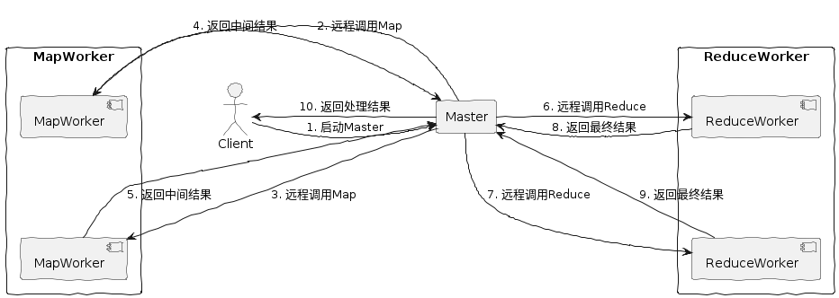

# MapReduce原理的介绍实验
## MapReduce简介
当我们遇到算力瓶颈时，一种很自然的想法就是采用分布式计算。但是要实现分布式计算，将应用程序运行在数千台计算机上，需要考虑如何将运算工作分发到数千台计算机、如何组织这些计算机、如何移动数据以及如何处理故障等等一系列细节问题。Google在处理大量搜索数据的排序时，提出了MapReduce这一设计。

MapReduce的的思想是，应用程序设计人员和分布式运算的使用者，只需要写简单的Map函数和Reduce函数，而不需要知道任何有关分布式的事情，MapReduce框架会处理剩下的事情。MapReduce框架的输入是被分割成大量的不同的数据的非常巨大数据块，这些被分成的规模较小的数据可以被并行运行多个只关注输入和输出的Map函数做分别的处理，这样子就可以天然的进行合理的任务分派并且得到一个最终涉及所有数据的处理结果，作为Reduce函数的输入。此处Map的结果可以加入一个Shuffle & Sort环节进行一些可能的分组和排序的操作，减轻网络负载并且使得Reduce的分配均衡。最后由Reduce函数分别计算（经过分组/排序这种预处理的）Map函数的输出得到最终的输出。
## 实验介绍
使用Java的单机来模拟MapReduce的分布式计算，完成《三体》的分词词频统计。
### 依赖项
- grpc *模拟分布式通信*
- org.apdplat.word *中文分词插件*
### 架构设计
- Master：通过RPC的服务实现来交付任务（即Map以及Reduce的输入），将Map后的大量<k, v>分组成为同k部分作为Reduce的输入、来使得Reduce各个worker的结果合并变得更加方便，将最终结果保存。
- Map：原本应该处理被分成简短的数据块，如果划分过短会出现由于暂停线程及恢复上下文过于频繁导致实验等待时间过长的情况，所以这里只是将《三体》三部原文（几乎等分 *为了防止词从一般分开所以存在几行级别的字数不同*）分为88个文件，使用线程池对此进行分布式场景的简单模拟，因为线程的创建和撤销都是比较重的操作，如果过于频繁会造成损耗，所以并没有采用协程那样大量创建的操作。通过结束一个任务后调用RPC请求任务的结果来区分下一步工作是提交还是继续。最终主线程将各个线程的结果进行合并，这一过程可以通过信号量来简化，由于这里线程有限、时间差不大，所以直接用了Future的get来阻塞主线程。Map往往是细粒度的操作，不需要额外的考虑，只需要增加String，本应当输出List<List/Map\<String(,Integer)>>，但是由于往往是1，这里直接输出一个默认值的列表表示。
- Reduce：通过RPC接受任务（被切分后的分组结果），将经过分组的输入List<List\<String>>转化为最终结果，由于已经分组所以采用putAll就能合并而不需要遍历多个Map。
- Worker：作为通信的中间部分，提供Map/Reduce服务。

即实现这样工作过程的模拟。

最终我们得到整体的通信设计为：

具体的设计为：

## 实验过程
按照架构设计内容，编写[proto3](src/main/proto/task.proto)定义（请求/响应）消息的格式以及Server提供的服务形式。我们定义服务来支持任务获取、请求以及结果的传递，以此为基础具体实现相关的通信代码。

在Master中定义Server分别提供Map和Reduce需要的任务，Client则分别获取两部分的结果。同时分组Map得到的中间结果利于下一步的输入。

在Worker定义通信相关的代码，接收Master的计算请求。
在Map和Reduce中分别实现逻辑。Map各个线程池循环请求需要处理的文件路径并处理，最终将线程池的各个数据合并，输出一个排列过分词的List。Reduce各个线程池循环请求需要已经分组过列表并处理，最终将线程池的各个数据合并并且排序，输出一个按照词频逆序排序的List。

分别运行得到[最终结果](src/main/resources/text/101.txt)，最终运行时长约为串行处理时长的1/6。
## 实验优化
主线程将各个线程的结果进行合并，这一过程可以通过信号量来简化、通过信号量的阻塞方式来并行的完成合并操作，但是由于时间差不大、没有采用。这里引出另一个问题，也就是这个合并实际上应该在Master来完成，因为实际的海量数据的合并会增大服务器侧存储及计算压力，传输会占用网络带宽，应该由小规模的线程池模拟worker与Master交互或者是写入后存储、只是将相关的信号发回Master后由Reduce处理，这里出于简化没有按照这样实现，来突出各个部分的模拟。
