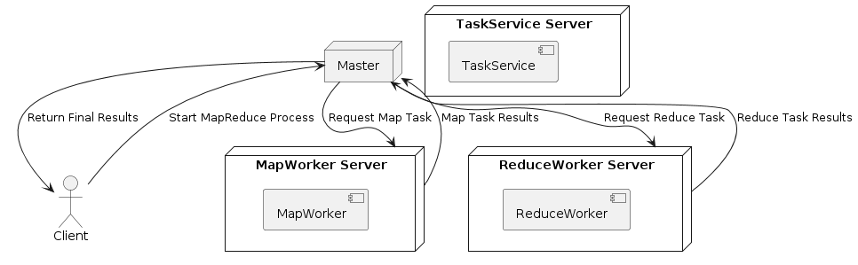

# MapReduce原理的介绍实验
## MapReduce简介
当我们遇到算力瓶颈时，一种很自然的想法就是采用分布式计算。但是要实现分布式计算，将应用程序运行在数千台计算机上，需要考虑如何将运算工作分发到数千台计算机、如何组织这些计算机、如何移动数据以及如何处理故障等等一系列细节问题。MapReduce的的思想是，应用程序设计人员和分布式运算的使用者，只需要写简单的Map函数和Reduce函数，而不需要知道任何有关分布式的事情，MapReduce框架会处理剩下的事情。
MapReduce框架的输入是被分割成大量的不同的数据的非常巨大数据块，这些被分成的规模较小的数据可以被并行运行多个只关注输入和输出的Map函数做分别的处理，这样子就可以天然的进行合理的任务分派并且得到一个最终涉及所有数据的处理结果，作为Reduce函数的输入。此处Map的结果可以加入一个Shuffle & Sort环节进行一些可能的分组和排序的操作，减轻网络负载并且使得Reduce的分配均衡。最后由Reduce函数分别计算（经过分组/排序这种预处理的）Map函数的输出得到最终的输出。
## 实验介绍
使用Java的单机来模拟MapReduce的分布式计算，完成《三体》的分词词频统计。
### 依赖项
- grpc *模拟分布式通信*
- org.apdplat.word *中文分词插件*
### 架构设计
原本本实验采用了直接的实现，但是由于中文分词时间消耗较大且我们这里没有实际的运算资源存在，做出纯粹的模拟会使得在调参数和修改的过程中存在长时间等待的问题，所以做出了一定取舍，最终的架构设计如下：
- Map函数：原本应该处理被分成简短的数据块，如果划分过短会出现由于暂停线程及恢复上下文过于频繁导致实验等待时间过长的情况，所以这里只是将《三体》三部原文（几乎等分 *为了防止词从一般分开所以存在几行级别的字数不同*）分为88个文件，使用线程池对此进行分布式场景的简单模拟。
- Shuffle & Reduce函数： 这个场景对于Map的输出不存在需要排序的情况。按照MapReduce框架应当由Map输出一个pair然后由Shuffle这个中间环节进行分组而后由Reduce进行运行。出于性能考虑最后采用Java map作为Map函数的处理结果，从而减少分组这一过程，而Reduce原应采用分布式计算参数长度，也因中间词数的具体体量、Shuffle结果分批处理设计（*Reduce仍需要线程资源、中间替换存在问题*）存在一定问题，所以采用在直接是用归并的方式来单线程的归并各个数据块的内容作为结果，即这样的处理逻辑：

最终我们得到整体的通信设计为：

Map函数的具体模拟方式为：

## 实验过程
按照架构设计内容，编写[proto3](src/main/proto/task.proto)定义（请求/响应）消息的格式以及Server提供的服务形式。我们定义请求信息包含路径前缀、路径后缀以及需要处理的最大编号。响应信息是一个重复的Map<string, int>。通过grpc依赖生成相应的通信代码，以此为基础具体实现Clients和Servers的类中相关的通信代码。
在Client编写请求和Reduce过程的具体逻辑，在Servers中以grpc定义的服务为基础编写处理顺序及响应发送的具体逻辑，在CountTime编写Map过程的具体逻辑并使用线程池来模拟分布式的场景。
分别运行Servers和Clients得到[最终结果](src/main/resources/text/100.txt)，最终运行时长约为串行处理时长的1/6。
## 实验优化
这里在模拟分布式的时候，采用了线程池submit后调用future的get来获取是否完成并阻塞CountTime主逻辑，这里可以做一个类似IO多路复用的模拟，也就是通过wait-notify来完成轮询时机的把控，但是由于架构设计中提到的硬件原因（job的规模相当、线程资源的有限性以及二者最终导致的架构设计），这种处理并没有减少时间，但我们确实可以做这样的有效优化：在MapReduce框架的介绍中，我们可以看到他是直线式的逻辑，类似fork-join这样的处理，将可以大量的数据拆分后进行简单逻辑的分布式计算且结果层层关联；这样子分组和规约操作都会提早一步进行、从而更快地达到结果。
